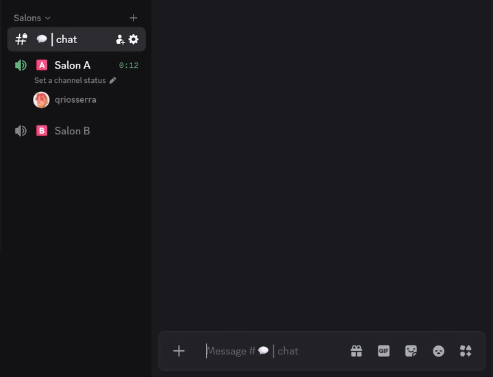

# Jarvis



A Discord bot designed for interactions within a guild, supporting text and, soon, voice. Jarvis listens to messages, identifies the user’s intent using a language model (LLM), performs deterministic actions within the guild or generates conversational responses, and maintains a long-term semantic memory for each member.

## Documentation

Full architecture and schema reference lives under [`docs/`](./docs/index.md).

## Tech Stack

- **Runtime**: Node.js ≥ 22, TypeScript, pnpm
- **Discord**: discord.js v14, @discordjs/voice
- **Database**: PostgreSQL 17 + pgvector (Kysely query builder)
- **Queue**: BullMQ backed by Redis
- **LLM**: xAI (Grok) or OpenAI — configurable per role (interpretation / response / embedding)
- **Embeddings**: Voyage
- **Speech-to-text**: Deepgram
- **Text-to-speech**: Cartesia
- **Web research**: Tavily
- **Observability**: OpenTelemetry (traces + metrics via OTLP)
- **Logging**: Pino (console, file, and optional DB transport)

## Prerequisites

- Node.js ≥ 22
- pnpm ≥ 10
- Docker (for infrastructure containers)
- A Discord application with **MESSAGE CONTENT INTENT** and **SERVER MEMBERS INTENT** enabled in the [Developer Portal](https://discord.com/developers/applications)

## Getting Started

### 1. Configure environment

```bash
cp .env.example .env
```

Fill in at minimum:

| Variable | Description |
| --- | --- |
| `DISCORD_TOKEN` | Bot token from the Developer Portal |
| `DISCORD_CLIENT_ID` | Application (client) ID |
| `XAI_API_KEY` | xAI API key (or `OPENAI_API_KEY` if using OpenAI) |
| `VOYAGE_API_KEY` | Voyage embeddings API key |
| `DEEPGRAM_API_KEY` | Deepgram STT API key |
| `CARTESIA_API_KEY` | Cartesia TTS API key |
| `TAVILY_API_KEY` | Tavily web research API key |

### 2. Start infrastructure

```bash
pnpm infra:up
```

Starts PostgreSQL 17 (with pgvector) and Redis via Docker Compose.

### 3. Apply the database schema

```bash
pnpm db:migrate
```

### 4. Run in development

```bash
pnpm dev
```

Hot-reloads on source changes via `tsx watch`.

## Running with Docker (full stack)

```bash
docker compose -f docker-compose.dev.yml up
```

Starts PostgreSQL, Redis, and the bot container together with live source mounting.

## Available Scripts

| Script | Description |
| --- | --- |
| `pnpm dev` | Start with hot reload (requires local Node + infra) |
| `pnpm build` | Compile TypeScript to `dist/` |
| `pnpm start` | Run the compiled build |
| `pnpm test` | Run the test suite once |
| `pnpm test:watch` | Run tests in watch mode |
| `pnpm lint` | Lint `src/` |
| `pnpm db:migrate` | Apply pending migrations |
| `pnpm db:reset` | Drop and recreate the database from `schema.sql` |
| `pnpm cli` | Interactive CLI against the compiled build |
| `pnpm cli:dev` | Interactive CLI against source |
| `pnpm validate:dev` | Validate startup configuration against source |
| `pnpm infra:up` | Start PostgreSQL + Redis containers |
| `pnpm infra:down` | Stop PostgreSQL + Redis containers |

## Architecture Overview

Jarvis processes requests through a single orchestrator pipeline:

1. **Entry** — a text mention or a voice utterance produces an `InteractionContext`.
2. **Bootstrap** — guild, user, and membership rows are upserted; an interaction row is created.
3. **Intent classification** — an LLM classifies the request into a deterministic action or a conversational intent.
4. **Execution** — deterministic actions (join voice, move/mute/deafen/rename member, send message) run through a memory-safety gate; conversational intents retrieve semantic memory, call the LLM, and deliver a text or TTS response.
5. **Memory** — memories are extracted asynchronously, embedded by a BullMQ worker, and consolidated on a background schedule.

See [`docs/activity-diagrams.md`](./docs/activity-diagrams.md) for PlantUML diagrams of each pipeline stage.

## Personas

The database seeds two personas: `jarvis` (default) and `friday`. The active persona is controlled by the `DEFAULT_PERSONA` environment variable.

## Observability

Set `OTEL_EXPORTER_OTLP_ENDPOINT` to export traces and metrics to any OTLP-compatible collector (e.g. Grafana, Jaeger, Honeycomb). Database logging is enabled by setting `LOG_DB_ENABLED=true`.
