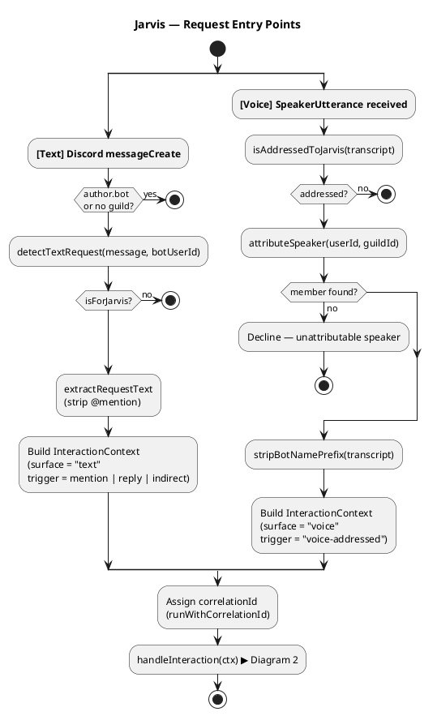
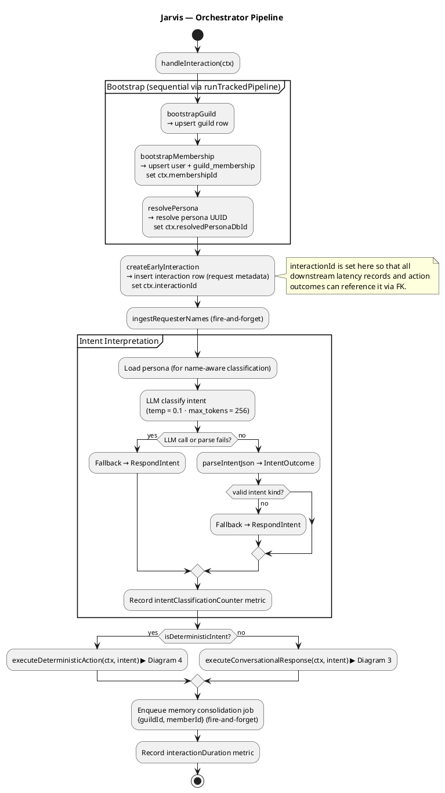
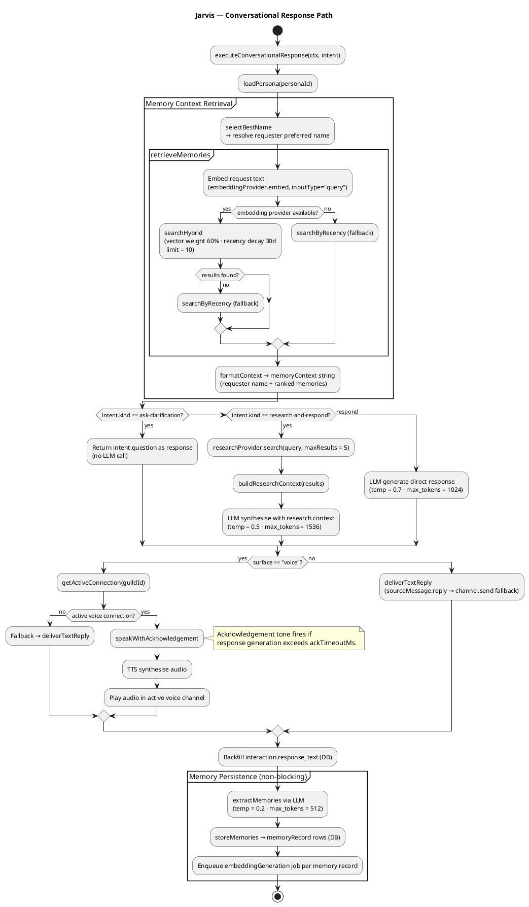
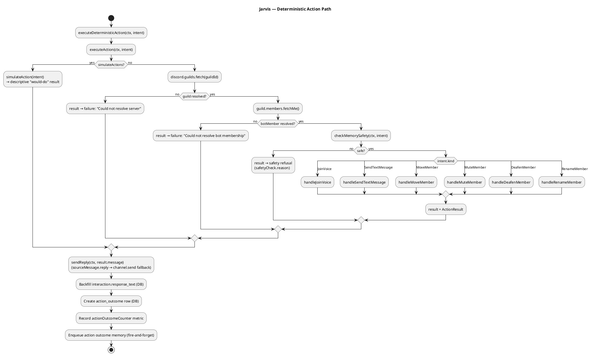
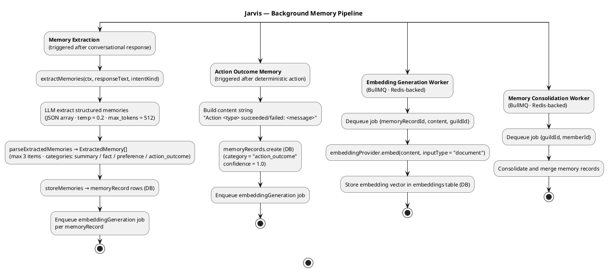

# Activity Diagrams

Visual representation of the operations that run during a Jarvis interaction.
Each diagram is written in [PlantUML](https://plantuml.com/activity-diagram-beta) activity-diagram syntax and can be rendered with the VS Code PlantUML extension, the [online server](https://www.plantuml.com/plantuml/uml), or any PlantUML-compatible tool.

## Table of Contents

1. [Request Entry Points](#1-request-entry-points)
2. [Orchestrator Pipeline](#2-orchestrator-pipeline)
3. [Conversational Response Path](#3-conversational-response-path)
4. [Deterministic Action Path](#4-deterministic-action-path)
5. [Background Memory Pipeline](#5-background-memory-pipeline)

---

## 1. Request Entry Points

Covers the two surfaces (text message and voice utterance) that produce an `InteractionContext` and hand off to the orchestrator.

**Key files:** `src/discord/events.ts`, `src/voice/speech-detect.ts`

---

## 2. Orchestrator Pipeline

The core `handleInteraction` flow: bootstraps persistent state, creates the early interaction row, classifies intent via LLM, then routes to one of the two execution paths.

**Key files:** `src/interaction/orchestrator.ts`, `src/conversation/interpret.ts`

---

## 3. Conversational Response Path

Handles the `respond`, `ask-clarification`, and `research-and-respond` intent kinds. Retrieves memory context, generates a response, delivers it surface-appropriately, then persists memories asynchronously.

**Key files:** `src/conversation/respond.ts`, `src/memory/retrieve.ts`, `src/memory/persist.ts`

---

## 4. Deterministic Action Path

Handles guild-mutating actions (voice join, member move / mute / deafen / rename, send text message). Runs a memory safety gate before execution, then delivers the result and persists the outcome.

**Key files:** `src/actions/executor.ts`, `src/actions/handlers.ts`, `src/memory/safety.ts`

---

## 5. Background Memory Pipeline

Shows the four independent async pipelines that run outside the latency-critical path. Memory extraction and action outcome persistence enqueue jobs consumed by the embedding worker; the consolidation worker runs on a separate schedule.

**Key files:** `src/memory/extract.ts`, `src/memory/persist.ts`, `src/queue/workers/embedding-generation.ts`, `src/queue/workers/memory-consolidation.ts`

